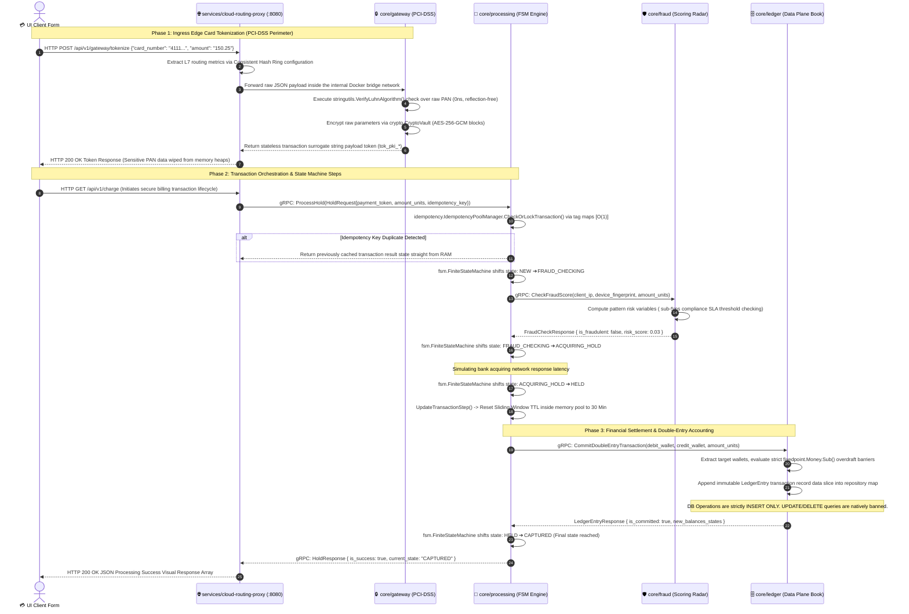

# 🪐 CLEARWAY PAY FINTECH PROCESSING CORE (OPERATOR CLASS)

Distributed high-performance transactional payment core engineered under strict PCI-DSS segregation patterns. Powered by Go 1.25.0 Workspaces, an immutable Double-Entry Bookkeeping Append-Only Ledger, a reflection-free O(1) Functional Command Dispatcher, and a Lock-Free CPU-Atomic CAS TPS rate limiter [1.1, 2.1].

Высокопроизводительное распределенное транзакционное финтех-ядро процессинга операторского класса, спроектированное по строгим стандартам изоляции контуров PCI-DSS. Платформа построена на базе Go 1.25.0 Workspaces, иммутабельной книги балансов двойной записи (Append-Only Ledger), безрефлексивного O(1) диспетчера команд и Lock-Free атомарного лимитера TPS на регистрах CPU [1.1, 2.1].

---

## 🛠️ DOCUMENTATION MAP & RUNTIME MANUAL / КАРТА СПЕЦИФИКАЦИЙ И ЗАПУСК

*   🚀 **[LAUNCH.md](LAUNCH.md)** — step-by-step cold initialization, Go Workspace compilation, gRPC stubs build, and deployment guide [2.1].
*   🚀 **[LAUNCH.md](LAUNCH.md)** — пошаговый регламент холодной инициализации, сборки Go воркспейсов, компиляции gRPC и запуска шлюза [2.1].
*   🗺️ **[docs/navigation.md](docs/navigation.md)** — unified index link board routing to detailed Software Requirement Specifications (SRS) and Low-Level Component Specifications [2.1].
*   🗺️ **[docs/navigation.md](docs/navigation.md)** — единая навигационная карта, ведущая к детальным Техническим Заданиям (SRS) и спецификациям каждого модуля [2.1].

---

## 📐 1. GLOBAL ARCHITECTURE & TOPOLOGY (DATA FLOW)

The ecosystem is segregated into three strictly isolated tiers: **Ingress Edge Plane** (stateless routing proxy), **Control Plane Core** (Finite State Machine transaction orchestrator), and **Data Plane Ledger** (immutable accounting volumes) [2.1].

Экосистема разделена на три изолированных эшелона: **Ingress Edge Plane** (сетевой прокси-регулировщик), **Control Plane Core** (стейт-машина оркестрации шагов транзакции) и **Data Plane Ledger** (иммутабельная книга балансов) [2.1].

### 📊 Comprehensive Request-Response Sequence Diagram / Подробная диаграмма вызовов

---

## 🎰 2. STRUCTURAL DOMAIN DECOUPLING / РАЗДЕЛЕНИЕ КОНТУРОВ СИСТЕМЫ

1.  **`services/` (Network Infrastructure Edge)**: ontains stateless reverse-proxies, configuration chassis routers, and L7 switches [2.1]. Free from any financial context or business-logic variables [1.1].
2.  **`core/` (Transactional Monolith Core)**: encapsulates high-availability banking sub-domains [2.1]. Bound strictly to interface abstraction models, allowing immediate zero-code-change microservice partitioning onto separate machines or Kubernetes nodes [1.1, 2.1].
3.  **`internal/pkg/` (Blazing Fast Shared Frameworks)**: reflection-free, zero-allocation algorithms общего назначения ($O(1)$ maps registry dispatchers, CPU-atomic CAS token buckets, memory-sharded sliding-window caches) [1.1].
