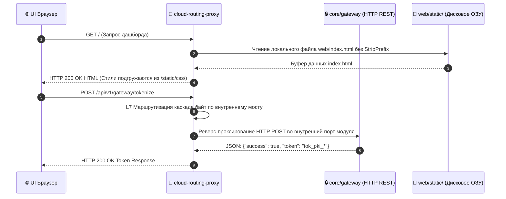

# 🌐 LOW-LEVEL SPECIFICATION: CLOUD ROUTING PROXY / API INGRESS

[English version below]

## 🇷🇺 РУССКАЯ ВЕРСИЯ

### 1. Архитектура Шасси и Инициализация Конфигурации
Компонент `services/cloud-routing-proxy` (Порт `:8080`) инициализируется на базе абстрактного системного шасси `internal/chassis` [2.1]. На этапе старта функция `chassis.LoadConfigAbstract()` парсит файл `config.yaml` в структуру `chassis.BaseConfig`, выставляя порты рантайма.

### 📊 Диаграмма Маршрутизации и Раздачи Статики (Ingress Invariant):

---

## 🇺🇸 ENGLISH VERSION

### 1. Ingress Layer Routing Mechanics
The Ingress proxy maps public-facing URI endpoints to isolated container ports. It hosts a native file server mounting the `web/` directory directly under the strict `/static/` context location [2.1].
