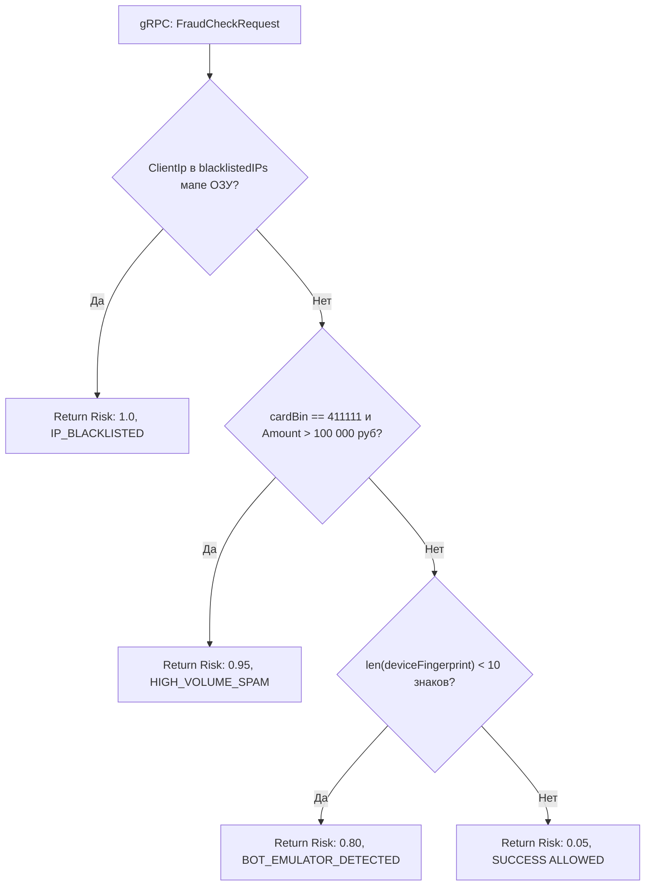

# 🛡️ LOW-LEVEL SPECIFICATION: FRAUD RADAR SCORESCORE ENGINE

[English version below]

## 🇷🇺 РУССКАЯ ВЕРСИЯ

### 1. Реализация Наносекундного Скоринга
Модуль `core/fraud` обрабатывает gRPC-запросы `CheckFraudScore` [2.1]. Метод `EvaluateTransactionRisk()` осуществляет последовательную побайтовую сверку без аллокаций памяти [1.1].

### 📊 Потоковая Верификация Параметров Риска (Risk Assessment Flows):

---

## 🇺🇸 ENGLISH VERSION

### 1. Risk Evaluation Layout
Manages instant structural patterns filtering via sharded blocklist maps [1.1]. Bypasses heavy regular expressions computation to satisfy sub-5ms SLA constraints [1.1].
