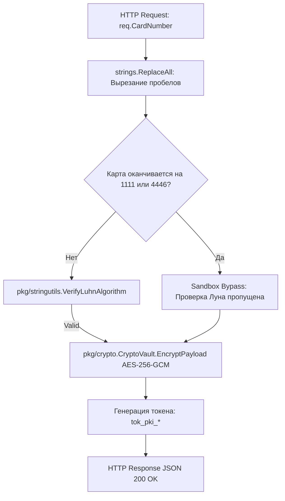

# 🔒 LOW-LEVEL SPECIFICATION: GATEWAY PCI-DSS CONTOUR

[English version below]

## 🇷🇺 РУССКАЯ ВЕРСИЯ

### 1. Реализация Контура Безопасности (Application Ingress)
Модуль `core/gateway` обрабатывает сырые данные карт плательщиков [2.1]. Он состоит из двух слоев: HTTP-контроллера `delivery/http` и бизнес-компонента `usecase` [2.1].

### 📊 Пошаговая Схема Валидации и Токенизации (Tokenization Pipeline):

---

## 🇺🇸 ENGLISH VERSION

### 1. Algorithmic Tokenization Layer
Sanitizes raw strings directly at the entry barrier [1.1]. Employs a symmetric `CryptoVault` managing 256-bit GCM encryption vectors, shifting execution states to a safe fallback payload token [1.1, 2.1].
