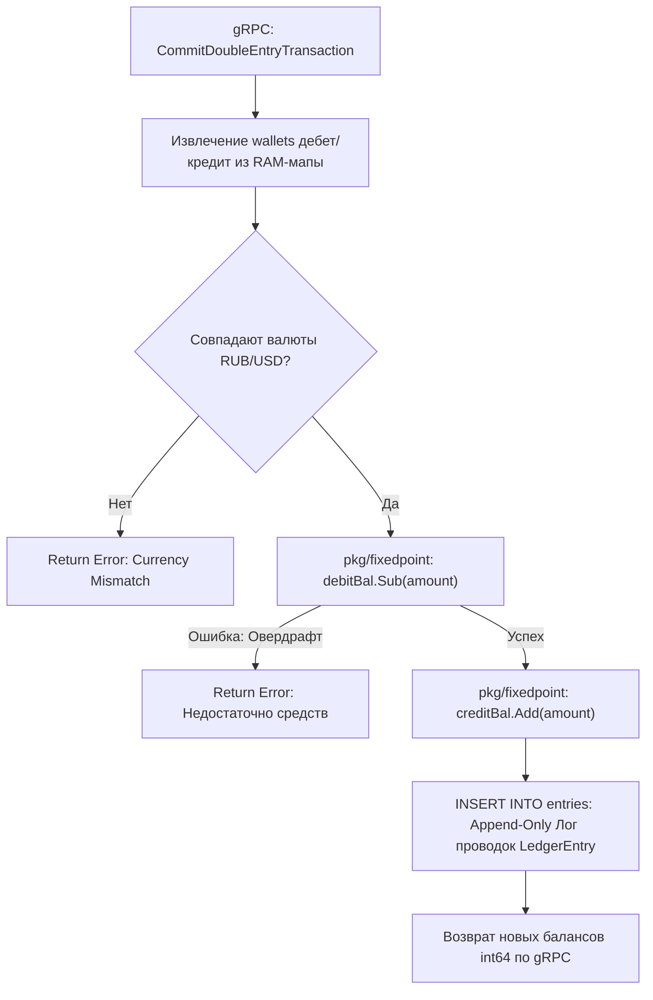

# 🗄️ LOW-LEVEL SPECIFICATION: IMMUTABLE TRANSACTIONS LEDGER

[English version below]

## 🇷🇺 РУССКАЯ ВЕРСИЯ

### 1. Архитектура Данных Двойной Записи (Data Plane Engine)
Модуль `core/ledger` реализует логику учета балансов [2.1]. Защита овердрафта и балансовые вычисления выполняются в неделимых копейках через безвыделенный тип `fixedpoint.Money`, полностью отсекая `float64` [1.1].

### 📊 Схема Мутации Состояний Балансов в ОЗУ (Ledger Commit Pipeline):

---

## 🇺🇸 ENGLISH VERSION

### 1. Append-Only Datastore Mechanics
Enforces an immutable transactional memory ledger model [1.1, 2.1]. State verification logic intercepts the gRPC transport layer, routing balances execution flows into strict integer bit subtraction subroutines [1.1, 2.1].
