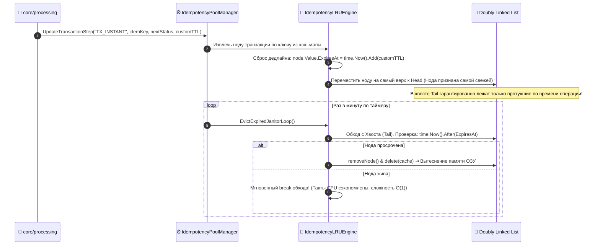

# ⏰ FUNCTION SPECIFICATION: MEMORY-SHARDED SLIDING WINDOW IDEMPOTENCY POOL

[English version below]

## 🇷🇺 РУССКАЯ ВЕРСИЯ

### 1. Структура Памяти и Хронологический Инвариант
Компонент `internal/pkg/idempotency` объединяет хэш-мапу `map[string]*Node` (O(1) поиск) и двусвязный список Doubly Linked List (O(1) вытеснение и упорядочивание дедлайнов) [1.1]. Пул `IdempotencyPoolManager` распределяет транзакции по изолированным маппированным контурам времени на базе строковых тегов категорий (High Cohesion) [1.1].

### Схема Организации Шардов Памяти в ОЗУ:
```text
  [Имя Категории: "TX_INSTANT"] ➔ Инстанс LRU-1 ➔ [ Head (Свежие) ] ⇄ [ Node ] ⇄ [ Tail (Дедлайн) ]
  [Имя Категории: "TX_STANDARD"] ➔ Инстанс LRU-2 ➔ [ Head (Свежие) ] ⇄ [ Node ] ⇄ [ Tail (Дедлайн) ]
```

### 📊 Диаграмма Скользящего Окна Жизни Сессии (Sliding Window Pipeline):


---

## 🇺🇸 ENGLISH VERSION

### 1. Cache Cohesion & Partitioning Model
Engineers volatile memory layer consistency by pairing hash maps with symmetric doubly linked timelines [1.1]. Moving mutated nodes dynamically to the `Head` position guarantees that the `Tail` register maintains strict chronological deadline ordering [1.1].
