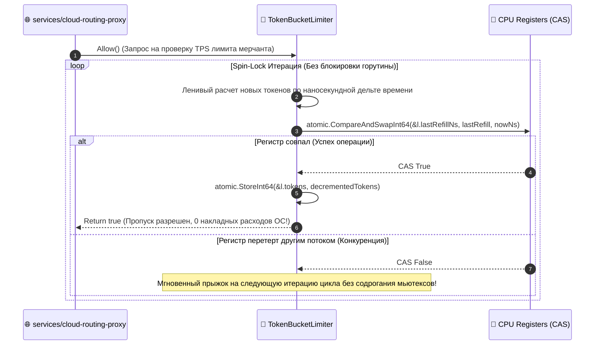

# 🚦 FUNCTION SPECIFICATION: LOCK-FREE CPU-ATOMIC CAS RATE LIMITER

[English version below]

## 🇷🇺 РУССКАЯ ВЕРСИЯ

### 1. Архитектура Безблокировочного Алгоритма Token Bucket
Компонент `internal/pkg/ratelimit` защищает gRPC-каналы без использования мьютексов `sync.Mutex` [1.1]. Синхронизация потоков Go перенесена на уровень регистров процессора через атомарные инструкции **Compare-And-Swap (CAS)** пакета `sync/atomic` [1.1].

### Схема Регистров Многопоточного Списания Токенов в ОЗУ:
```text
  Поток Go-1 ───┐
  Поток Go-2 ───┼─> atomic.LoadInt64(&l.lastRefillNs) ➔ Ленивое начисление токенов по дельте времени
  Поток Go-3 ───┘
                       │
                       ▼
             [ Инструкция CPU: CompareAndSwapInt64() ]
         ┌─────────────┴─────────────┐
    Успех (CAS == true)         Отказ (CAS == false)
         │                           │
         ▼                           ▼
  Токен списан, Allow() = true   Конкуренция! Уход на новый цикл повтора (Spin-Lock)
```

### 📊 Диаграмма Вызовов и Процессорных Итераций (Atomic CAS Loop):


---

## 🇺🇸 ENGLISH VERSION

### 1. Mutex-Free Synchronization Model
Component `ratelimit/limiter.go` offloads thread synchronization tasks from operating system schedulers directly onto hardware memory registers [1.1]. The multi-threaded execution path runs inside an atomic `Compare-And-Swap` spin-lock block, achieving near-zero processing branch mispredictions under high-load TPS workloads [1.1].
