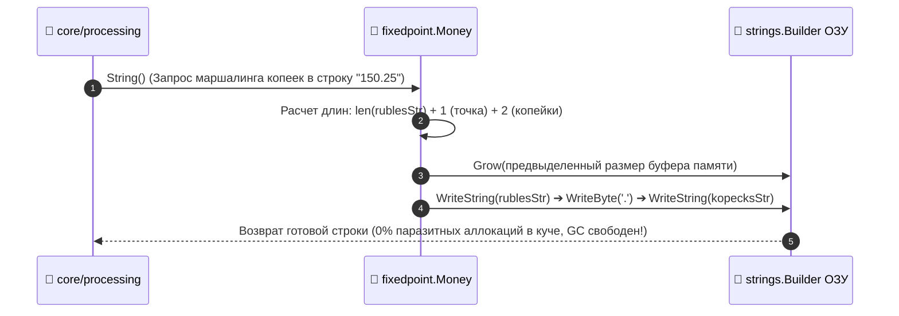

# 🧮 FUNCTION SPECIFICATION: ZERO-ALLOCATION FIXED-POINT FINTECH MATH

[English version below]

## 🇷🇺 РУССКАЯ ВЕРСИЯ

### 1. Алгоритмическая Физика Модуля `internal/pkg/fixedpoint`
Компонент `math.go` реализует точные финансовые вычисления над примитивным типом `int64 Units` [1.1].

### Схема Устройства ОЗУ и Буфера Парсинга Строки:
```text
  Входная b2b-строка "150.25"
         │
         ▼ [Ручной побайтовый скан без рефлексии и fmt.Sscanf]
  Выделение рублей:  "150" ➔ ParseInt ➔ 150 * 100 = 15000 копеек
  Выделение копеек:  "25"  ➔ ParseInt ➔ 25 копеек
         │
         ▼
  Итоговая структура Money: { Units: 15025 } ➔ Вычисления на регистрах CPU за 1 такт!
```

### 📊 Диаграмма Сборки Строки через `strings.Builder.Grow` (Zero-Allocation Stringify):


---

## 🇺🇸 ENGLISH VERSION

### 1. Computational Efficiency Model
Component `fixedpoint/math.go` wipes out IEEE-754 floating-point accuracy vulnerabilities [1.1]. Direct allocation sizing via `strings.Builder.Grow` API enables runtime text formatting with zero runtime garbage-collection penalties [1.1].
