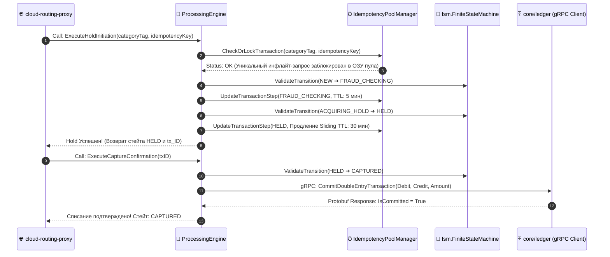

# 🎰 LOW-LEVEL SPECIFICATION: PROCESSING ENGINE / CONTROL PLANE

[English version below]

## 🇷🇺 РУССКАЯ ВЕРСИЯ

### 1. Реализация Архитектуры Оркестрации
Модуль `core/processing/usecase/engine.go` является координатором транзакций [2.1]. Он имплементирует интерфейсы и управляет пулом идемпотентности, стейт-машиной и gRPC-коммуникациями плоскости данных [1.1, 2.1].

### 📊 Диаграмма Вызовов и Атомарных Переходов (Processing Pipeline):

---

## 🇺🇸 ENGLISH VERSION

### 1. Orchestration Core Mechanics
Coordinates transactional flows by coupling atomic FSM maps with an extensible gRPC data conduit [1.1, 2.1]. Utilizes structural interfaces under explicit dependency inversion guidelines [1.1].
